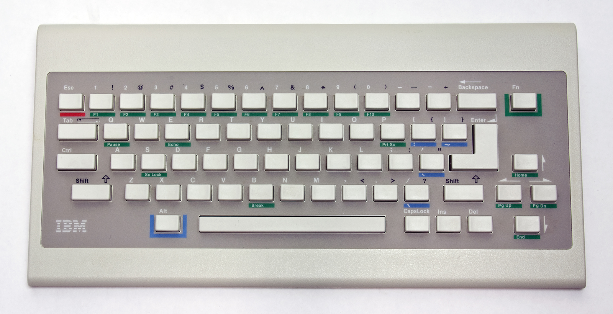
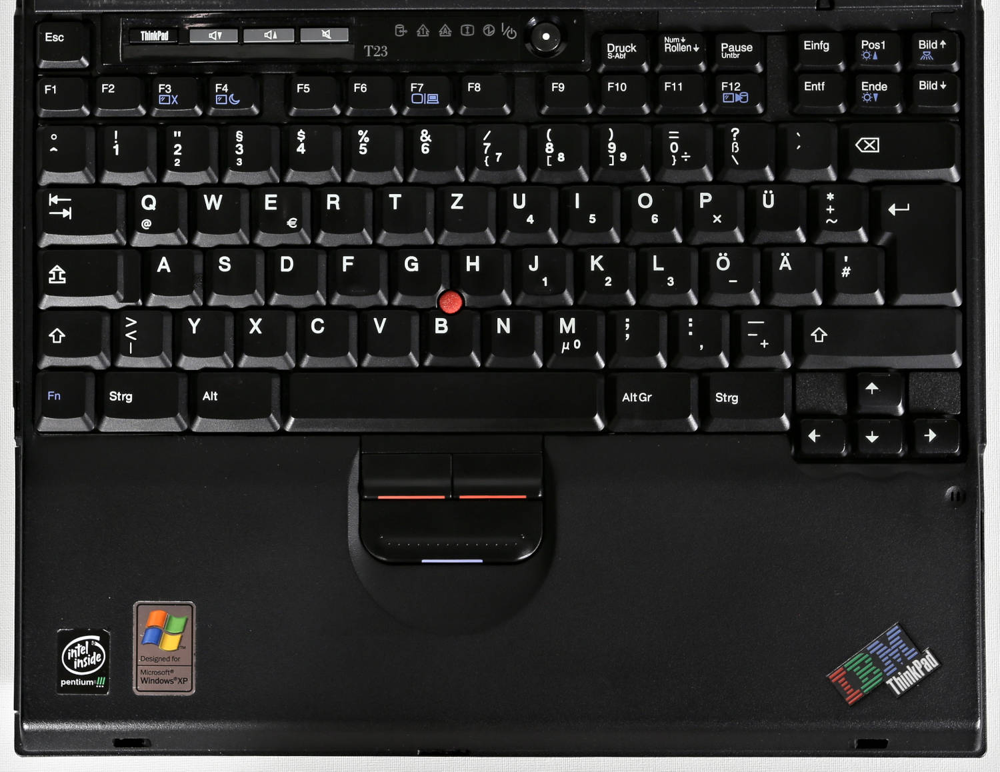
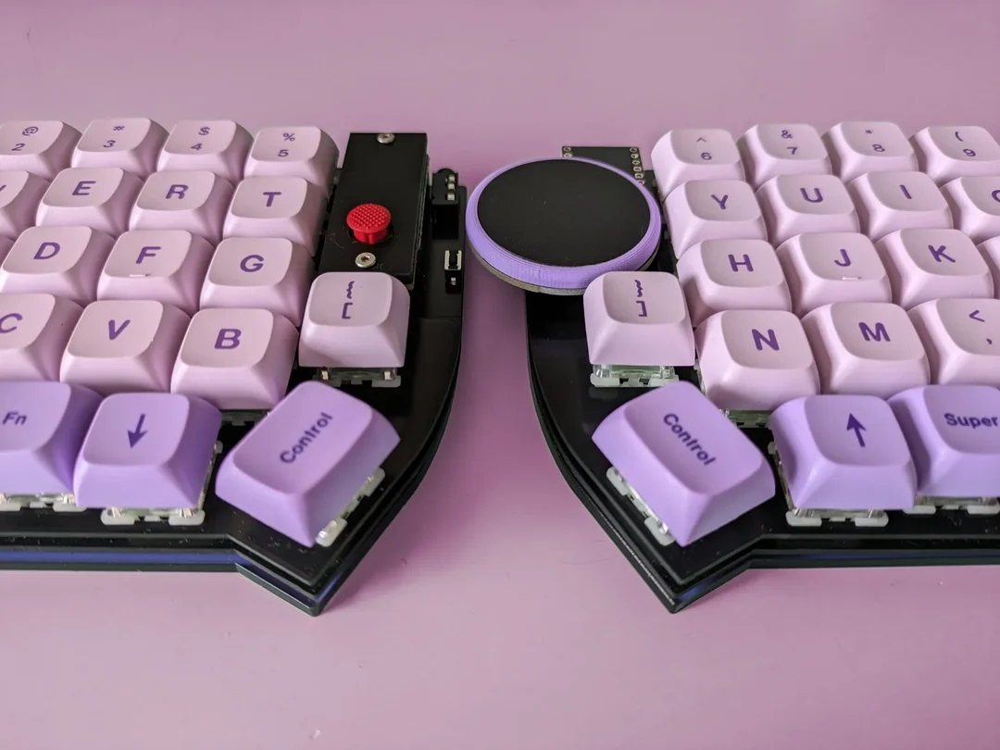
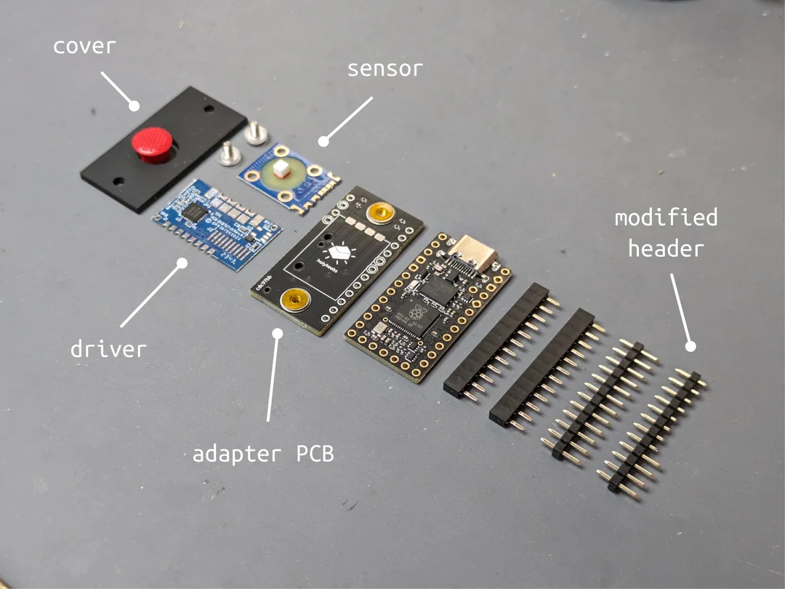

<!-- _class: lead -->

# 🔴 ThinkPads

#### Eingabegeräte und deren Einfluss auf mechanische Tastaturen

 

Christian ~~Clackowic~~ Stankowic
Mechanicon 2025
11.10.2025

---

<!-- _header: `whoami` -->

- Christian Stankowic
- [@stdevel@chaos.social](https://chaos.social/@stdevel) 🐘
- IT-Berater und -Trainer 👨🏻‍🏫
- sammelt obsolete Hardware
- Blogger ([cstan.io](https://cstan.io) 📖)
- Podcaster 🎙️
  - [Urlaub im Userspace](https://user.space) 🌴
  - [Faxinformatiker](https://faxinformatiker.de) 📠
  - [ThinkPad-Museum](https://thinkpad-museum.de/episode) 💻

---

<!-- _header: ThinkPad-Museum -->

- Online-Museum als **Blog**
- listet Details der Sammlung auf
  - **80** <u>unterschiedliche</u> Notebooks
  - **3** PDAs
  - **19** Docking Stationen
  - ich kann jederzeit aufhören!
- 🔴 [thinkpad-museum.de](https://thinkpad-museum.de)

---

<!-- _header: Kurzgeschichte des TrackPoints -->
<!-- footer: '[[1]](https://youtu.be/Wpw7Bml_XvI), Patent lief **2007** aus, auch andere Hersteller hatten vorher bereits Alternativen' -->

- in den späten **1980ern** von **Dr. Ted Selker** als Mausersatz erfunden*
- Gummifläche zwischen den **G**-, **H**- und **B**-Tasten
- **präzise** Bedienung, erinnert an **Joystick**
  - Finger kann auf der Tastatur verweilen
  - kein "Touchpad-Rudern"
  - erfordert Training
- ging mit dem ThinkPad 700 in Serie
  - inspirierte auch andere Hersteller

---

<!-- _header: Kurzgeschichte des TrackPoints -->
<!-- footer: '[[2]](https://de.wikipedia.org/wiki/Datei:Pointing_stick_of_a_Lenovo_ThinkPad_keyboard-4488.jpg), Patent lief **2007** aus, auch andere Hersteller hatten vorher bereits Alternativen' -->

- Funktion beruht auf **Messung** der ausgeübten Kraft über **Dehnungsstreifen**
- diese werden **elastisch** verformt, dauerhaft angelegte **Spannung** verändert sich so
- integrierter Schaltkreis wandelt diese analogen Signale um
- inzwischen auch in anderen Tastaturen zu finden

---

<!-- _header: Trivia: Unterschiedliche TrackPoint-Typen' -->
<!-- footer: '[[3]](https://www.reddit.com/r/thinkpad/comments/h16v1f/tizio_and_thinkpad_the_perfect_classical)' -->

<!--

- wurden die Jahre über immer optimiert
- wurden kleiner, da die Geräte auch kleiner werden
- billige Replicas erkennt man daran, dass sie schnell **speckig** werden

-->

---

<!-- _header: Tastaturen -->
<!-- footer: '' -->

- waren lange **USP** für ThinkPads
  - angenehmes taktiles Feedback
  - unverwüstliche Qualität
  - einfach zu wechseln
- IBM baute lange hochwertige Tastaturen
- zahlreiche Veränderungen im Laufe der Jahre
  - inzwischen nichts Besonderes mehr 🥲

---

<!-- _header: IBM und Tastaturen -->
<!-- footer: 'Höre auch [CCH029 - Model F 🎙️](https://www.clickclackhack.de/029.html) und [CCH015 - Model M 🎙️](https://www.clickclackhack.de/015.html)' -->

- IBM hat nach Schreibmaschinen lange Tastaturen produziert
  - [Model B](https://sharktastica.co.uk/wiki?id=modelb) - **Beamspring** (1972 - 1983)
  - [Model F](https://sharktastica.co.uk/wiki?id=modelf) - kapazitive **Buckling Springs** (1981 - 1986)
  - [Model M](https://sharktastica.co.uk/wiki?id=modelm) - Membran Buckling Springs (1984 - 1996)
- Nicht alle Tastaturen waren legendär: **IBM PCjr Keyboard**
- 1991 wurde Lexmark durch die Veräußerung von IBMs Drucker-/Tastatursparte gegründet
- 1996 stellte IBM den Verkauf von Buckling Spring-Tastaturen ein
- Ex-IBM/-Lexmark-Mitarbeitende gründeten so [Unicomp](https://www.pckeyboard.com)
- Model F und B werden seit 2016 auch [wieder produziert](https://www.modelfkeyboards.com/)

---

<!--
_header: 'IBM PCjr Keyboard (1983)'
footer: '[[4]](https://regmedia.co.uk/2014/03/20/keyboard_chiclet_large.jpg)' -->

---

<!--
_header: 'IBM PCjr Keyboard (1984) and Vortex PC66 (2023)'
footer: '[[5]](https://regmedia.co.uk/2014/03/20/keyboard_chiclet_large.jpg)' -->

Überarbeitetes IBM PCjr Keyboard

Vortex PC66

---

<!-- _header: ThinkPad-Tastaturen -->
<!-- footer: '[[6]](https://deskthority.net/wiki/Scissor_switch)' -->

- alle Generationen haben **Scissor Switches**
  - früher NMB, Chicony, ALPS, inzwischen nur noch Chicony und LiteOn
- gegenüberliegende Stabilisatoren, über ein Scharnier verbunden
- ermöglicht Scherenmechanismus mit geringer Höhe
- der **Tastenhub** sank über die Jahre
  - 3mm (199x), 2.5mm (2000-2012), 2.1mm (2013-2017), **1.8mm** (2016-2021), 1.5mm (2021-2024), 1,35mm (seit 2021)

---

<!-- _header: OG-Tastatur (hier: 760EL, 1996) -->
<!-- footer: '' -->

- 7-reihiges Design, bei kleinen Geräten nur 6 Reihen (z.B. 240)
- keine Sondertasten oder LEDs, vom 700 (1992) bis zum 600X (2000)

<!--

- Blaue und grüne Markeriungen für Mehrfachbelegungen

-->

---

<!-- _header: 'Klassische Tastatur (hier: T23, 2002)' -->

- mit dem A/T/X20 eingeführt, brachte u.a. **mittlere Maustaste**
- **Sondertasten** (Lautstärke, Setup), Status-**LEDs** und An/Aus-Knopf

---

<!-- _header: Precision-Keyboard (X230, 2012) -->
<!-- footer: '' -->

<!--

- 6 statt 7 Reihen, auch bei großen Geräten
  - mehr Platz zwischen den Tasten
  - größere Tasten, um Tippfehler zu vermeiden
  - keine separaten Funktionstasten mehr

-->

---

<!-- _header: Revival des Classic Keyboards (T25, 2017) -->

---

<!-- _header: ThinKeys- und Pineapple 60s-Projekte -->
<!-- footer: '[[7]](https://github.com/moduloindustries/thinkeys), [[8]](https://github.com/saoto28/pineapple60/)' -->

ThinKeys (2022)

Pineapple 60s (2020-2025)

<!--

- [ThinKeys](https://github.com/moduloindustries/thinkeys) Projekt
  - Ortholineare Tastatur für T410-30, T510-30, W510-30 und X220/230
  - QMK mit TrackPoint kann auch extern über USB-C verwendet werden
- [Pineapple 60](https://github.com/saoto28/pineapple60/)
  - Geteilte Tastatur für X13 und T440-460 

-->

---

<!-- _header: Einfluss auf mechanische Tastaturen -->
<!-- footer: '' -->

- Es gibt auch mechanische Tastaturen im **ThinkPad-Stil**, u.a.:
  - [Tex Shinobi](https://tex.com.tw/products/shinobi)
    - Replica des IBM/Lenovo [SK-8845](https://sharktastica.co.uk/topics/trackpoint_kbs#SK-8845)/[8855](https://sharktastica.co.uk/topics/trackpoint_kbs#SK-8855)
    - ABS, Cherry MX1A, USB-C, 1.2 kg
    - optional als [DIY-Edition](https://tex.com.tw/products/shinobi-diy-type) mit Hotswap
  - [Tex Shura](https://tex.com.tw/products/shura) (60%, TrackPoint und UltraNav)
    - ABS (US) bzw Laser (EU/JIS), Cherry MX1A, USB-C, 1.0 kg
    - optional als [DIY-Edition](https://tex.com.tw/products/shura-diy-type) mit Hotswap (aber ohne ISO-DE 🤡🤡🤡)
- Keycaps
  - [GMK ThinkCaps](https://drop.com/talk/39383/gmk-think-caps), schwarze Tasten, graue und blaue Akzente
    - optional auch klassische IBM-Farben

---

<!-- _header: Lenovo SK-8855 und Tex Shinobi -->
<!-- footer: '[[9]](https://sharktastica.co.uk/topics/trackpoint_kbs#SK-8855), [[10]](https://tex.com.tw/products/shinobi)' -->

Lenovo SK-8855 (2009)

Tex Shinobi (2020)

---

<!-- _header: Tex Shura (2022) -->
<!-- footer: '[[11]](https://tex.com.tw/products/shura)' -->

Optionales Aluminium-Gehäuse

---

<!-- _header: 'TrackPoint-Module' -->
<!-- footer: '[[12]](https://www.reddit.com/r/ErgoMechKeyboards/comments/1d6h7sr/ad_trackpoint_module_for_split_keyboards/)' -->

---

<!-- _header: Links und Bilderquellen -->
<!-- footer: '' -->

- [FrOSCon 2024: ThinkPads - Geschichte und Nerdkultur](https://github.com/stdevel/froscon2024-thinkpads/) [🎥](https://media.ccc.de/v/froscon2024-3141-thinkpads)
- [MRMCD 2024: Eingabegeräte und Kuriositäten](https://github.com/stdevel/mrmcd2024-thinkpads/) [🎥](https://media.ccc.de/v/2024-339-thinkpads-geschichte-und-trivia)
- [ThinkPad-Forum](https://thinkpad-forum.de) and [Wiki](https://thinkwiki.de)
- [Internationales ThinkWiki](https://thinkwiki.org)
- [Laptop Retrospective](https://laptopretrospective.com) 🎥📖
- [ThinkPad-Museum](https://thinkpad-museum.de)
- [ThinkPad-Museum Datenbank](https://db.thinkpad-museum.de)

- [Ted Selker](https://youtu.be/Wpw7Bml_XvI)
- [TrackPoint PCB](https://de.wikipedia.org/wiki/Datei:Pointing_stick_of_a_Lenovo_ThinkPad_keyboard-4488.jpg) und [Typen](https://www.reddit.com/r/thinkpad/comments/h16v1f/tizio_and_thinkpad_the_perfect_classical)
- [IBM PCjr Keyboard](https://regmedia.co.uk/2014/03/20/keyboard_chiclet_large.jpg), [Revised](https://regmedia.co.uk/2014/03/20/keyboard_chiclet_large.jpg)
- [Scissor Switch](https://deskthority.net/wiki/Scissor_switch)
- [ThinKeys](https://github.com/moduloindustries/thinkeys) und [Pineapple 60s](https://github.com/saoto28/pineapple60/)
- [Lenovo SK-8855](https://sharktastica.co.uk/topics/trackpoint_kbs#SK-8855)
- [Tex Shinobi](https://tex.com.tw/products/shinobi) und [Shura](https://tex.com.tw/products/shura)
- [TrackPoint module](https://www.reddit.com/r/ErgoMechKeyboards/comments/1d6h7sr/ad_trackpoint_module_for_split_keyboards/)

---

<!-- _header: ThinkPad-Museum Podcast -->

- erscheint **monatlich**
- beschäftigt sich mit der Geschichte und Gegenwart
- News, Modelle, Techniken und Persönlichkeiten
- **interaktives** Format, Gäst:innen willkommen!
- Überall, wo es Podcasts gibt™
  - [Feed](https://podcasts.darmstadt.social/@thinkpadmuseum/feed.xml), [fyyd](https://fyyd.de/podcast/thinkpad-museum-podcast), [Apple Podcasts](https://podcasts.apple.com/us/podcast/thinkpad-museum-podcast/id1722845536), [Spotify](https://open.spotify.com/show/1Tyf65RpY3bKZr0xYVFhjc)

---

<!-- _class: lead -->

# 🔴 Danke für die Aufmerksamkeit
