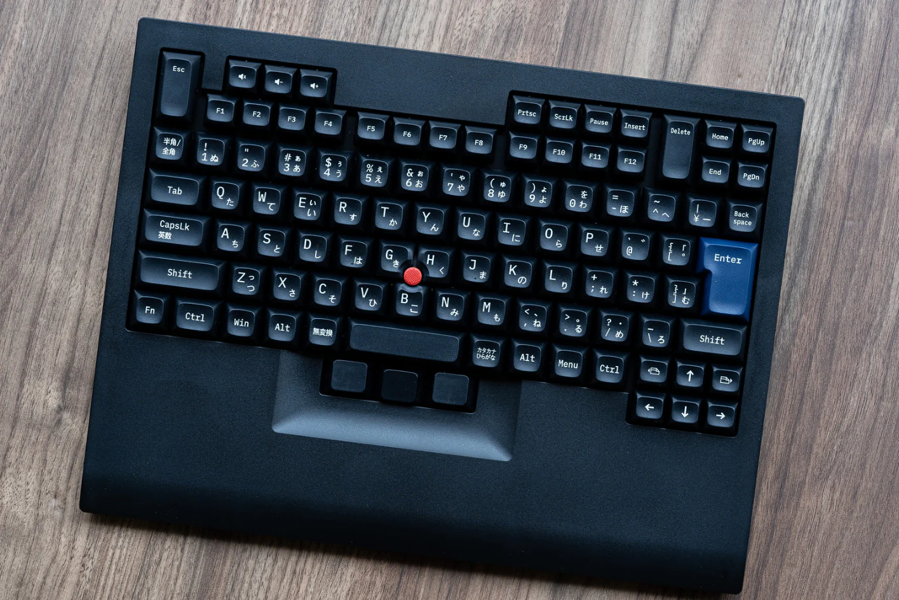

<!-- _class: lead -->

# 🔴 ThinkPads

#### Input devices and their influence on mechanical keyboards

 

Christian ~~Clackowic~~ Stankowic
Mechanicon 2025
11.10.2025

---

<!-- _header: `whoami` -->

- Christian Stankowic
- [@stdevel@chaos.social](https://chaos.social/@stdevel) 🐘
- IT consultant and trainer 👨🏻‍🏫
- collects obsolete hardware
- Blogger ([cstan.io](https://cstan.io) 📖)
- Podcaster 🎙️
  - [Urlaub im Userspace](https://user.space) 🌴
  - [Faxinformatiker](https://faxinformatiker.de) 📠
  - [ThinkPad-Museum](https://thinkpad-museum.de/episode) 💻

---

<!-- _header: ThinkPad museum -->

- Online museum as **blog**
- lists collection details
  - **80** <u>different</u> notebooks
  - **3** PDAs
  - **19** docking stations
  - I can stop collecting at any time!
- monthly **podcast** (🇩🇪)
- 🔴 [thinkpad-museum.com](https://thinkpad-museum.com)

---

<!-- _header: Short TrackPoint history -->
<!-- footer: '[[1]](https://youtu.be/Wpw7Bml_XvI), Patent expired **2007**, other manufacturers also had alternatives before then' -->

- invented in the late **1980s** by **Dr. Ted Selker** as a mouse replacement*
- Rubber surface between the **G**, **H** and **B** buttons
- **precise** operation, reminiscent of **joystick**
  - Finger can remain on the keyboard
  - no “touchpad rowing"
  - requires training
- went into production with the ThinkPad 700
  - also inspired other manufacturers

---

<!-- _header: Short TrackPoint history -->
<!-- footer: '[[2]](https://de.wikipedia.org/wiki/Datei:Pointing_stick_of_a_Lenovo_ThinkPad_keyboard-4488.jpg), Patent expired **2007**, other manufacturers also had alternatives before then' -->

- Function is based on **measurement** of the force exerted via **stretch marks**
- these are **elastically** deformed, permanently applied **tension** thus changes
- integrated circuit converts these analog signals
- can now also be found in other keyboards

---

<!-- _header: Trivia: Different TrackPoint types -->
<!-- footer: '[[3]](https://www.reddit.com/r/thinkpad/comments/h16v1f/tizio_and_thinkpad_the_perfect_classical)' -->

<!--

- have been continuously optimised over the years
- became smaller as the devices also became smaller
- Cheap replicas can be recognised by the fact that they quickly become **spotty**

-->

---

<!-- _header: Keyboards -->
<!-- footer: '' -->

- were **USP** for ThinkPads for a long time
  - pleasant tactile feedback
  - indestructible quality
  - easy to change
- IBM built high-quality keyboards for a long time
- Numerous changes over the years
  - no longer anything special 🥲

---

<!-- _header: IBM and keyboards -->
<!-- footer: 'Hear also [CCH029 - Model F 🎙️](https://www.clickclackhack.de/029.html) and [CCH015 - Model M 🎙️](https://www.clickclackhack.de/015.html)' -->

- IBM produced long keyboards after typewriters
  - [Model B](https://sharktastica.co.uk/wiki?id=modelb) - **Beamspring** (1972 - 1983)
  - [Model F](https://sharktastica.co.uk/wiki?id=modelf) - capacitive **Buckling Springs** (1981 - 1986)
  - [Model M](https://sharktastica.co.uk/wiki?id=modelm) - membrane Buckling Springs (1984 - 1996)
- Not all keyboards were legendary: **IBM PCjr Keyboard**
- In 1991, Lexmark was formed through the sale of IBM's printer/keyboard division
- 1996 IBM stopped selling Buckling Spring keyboards
- Ex-IBM/Lexmark employees founded [Unicomp](https://www.pckeyboard.com)
- Model F and B have also been [produced again](https://www.modelfkeyboards.com/) since 2016

---

<!--
_header: 'IBM PCjr Keyboard (1983)'
footer: '[[4]](https://regmedia.co.uk/2014/03/20/keyboard_chiclet_large.jpg)' -->

---

<!--
_header: 'IBM PCjr Keyboard (1984) and Vortex PC66 (2023)'
footer: '[[5]](https://regmedia.co.uk/2014/03/20/keyboard_chiclet_large.jpg)' -->

Revised IBM PCjr Keyboard

Vortex PC66 keyboard

---

<!-- _header: ThinkPad keyboards -->
<!-- footer: '[[6]](https://deskthority.net/wiki/Scissor_switch)' -->

- all generations have **scissor switches**
  - formerly NMB, Chicony, ALPS, now only Chicony and LiteOn
- Opposite stabilizers, connected via a hinge
- enables scissor mechanism with low height
- the **key travel** decreased over the years
  - 3mm (199x), 2.5mm (2000-2012), 2.1mm (2013-2017), **1.8mm** (2016-2021), 1.5mm (2021-2024), 1.35mm (since 2021)

---

<!-- _header: OG keyboard (here: 760EL, 1996) -->
<!-- footer: '' -->

- 7-row design, only 6 rows on small devices (e.g. 240)
- no special keys or LEDs, from the 700 (1992) to the 600X (2000)

<!--

- Blue and green markers for multiple assignments

-->

---

<!-- _header: 'Classic keyboard (here: T23, 2002)' -->

- introduced with the A/T/X20, had also **middle mouse button**
- **special buttons** (volume, setup), status **LEDs** and on/off button

---

<!-- _header: Precision keyboard (X230, 2012) -->
<!-- footer: '' -->

<!--

- 6 instead of 7 rows, even on large devices
  - more space between the keys
  - larger keys, to prevent typing errors
  - no more separate function keys

-->

---

<!-- _header: Classic keyboard revival (T25, 2017) -->

<!--

- Model for the 25th Anniversary
- only 300 models sold in Germany

-->

---

<!-- _header: ThinKeys and Pineapple 60s projects -->
<!-- footer: '[[7]](https://github.com/moduloindustries/thinkeys), [[8]](https://github.com/saoto28/pineapple60/)' -->

ThinKeys (2022)

Pineapple 60s (2020-2025)

<!--

- [ThinKeys](https://github.com/moduloindustries/thinkeys) project
  - Ortholinear keyboard for T410-30, T510-30, W510-30 and X220/230
  - QMK, with TrackPoint, can also be used externally via USB-C
- [Pineapple 60](https://github.com/saoto28/pineapple60/)
  - Split keyboard for X13 and T440-460 

-->

---

<!-- _header: Influence on mechanical keyboards -->
<!-- footer: '' -->

- There are also mechanical keyboards in **ThinkPad style**, e.g:
  - [Tex Shinobi](https://tex.com.tw/products/shinobi)
    - Replica of IBM/Lenovo [SK-8845](https://sharktastica.co.uk/topics/trackpoint_kbs#SK-8845)/[8855](https://sharktastica.co.uk/topics/trackpoint_kbs#SK-8855)
    - ABS, Cherry MX1A, USB-C, 1.2 kg
    - optionally as [DIY edition](https://tex.com.tw/products/shinobi-diy-type) with hotswap
  - [Tex Shura](https://tex.com.tw/products/shura) (60%, TrackPoint and UltraNav)
    - ABS (US) or laser (EU/JIS), Cherry MX1A, USB-C, 1.0 kg
    - optionally as [DIY edition](https://tex.com.tw/products/shura-diy-type) with hotswap
- Keycaps
  - [GMK ThinkCaps](https://drop.com/talk/39383/gmk-think-caps), black keys, grey and blue accents
    - optionally also classic IBM colours

---

<!-- _header: Lenovo SK-8855 and Tex Shinobi -->
<!-- footer: '[[9]](https://sharktastica.co.uk/topics/trackpoint_kbs#SK-8855), [[10]](https://tex.com.tw/products/shinobi)' -->

Lenovo SK-8855 (2009)

Tex Shinobi (2020)

---

<!-- _header: Tex Shura (2022) -->
<!-- footer: '[[11]](https://tex.com.tw/products/shura)' -->

Optional aluminium case

---

<!-- _header: 'TrackPoint modules' -->
<!-- footer: '[[12]](https://www.reddit.com/r/ErgoMechKeyboards/comments/1d6h7sr/ad_trackpoint_module_for_split_keyboards/)' -->

---

<!-- _header: Links and image sources -->
<!-- footer: '' -->

- [FrOSCon 2024: ThinkPads - Geschichte und Nerdkultur](https://github.com/stdevel/froscon2024-thinkpads/) [🎥🇩🇪](https://media.ccc.de/v/froscon2024-3141-thinkpads)
- [MRMCD 2024: Eingabegeräte und Kuriositäten](https://github.com/stdevel/mrmcd2024-thinkpads/) [🎥🇩🇪](https://media.ccc.de/v/2024-339-thinkpads-geschichte-und-trivia)
- [ThinkPad-Forum](https://thinkpad-forum.de) and [Wiki](https://thinkwiki.de)
- [International ThinkWiki](https://thinkwiki.org)
- [Laptop Retrospective](https://laptopretrospective.com) 🎥📖
- [ThinkPad-Museum](https://thinkpad-museum.de)
- [ThinkPad-Museum database](https://db.thinkpad-museum.de)

- [Ted Selker](https://youtu.be/Wpw7Bml_XvI)
- [TrackPoint PCB](https://de.wikipedia.org/wiki/Datei:Pointing_stick_of_a_Lenovo_ThinkPad_keyboard-4488.jpg) and [types](https://www.reddit.com/r/thinkpad/comments/h16v1f/tizio_and_thinkpad_the_perfect_classical)
- [IBM PCjr Keyboard](https://regmedia.co.uk/2014/03/20/keyboard_chiclet_large.jpg), [Revised](https://regmedia.co.uk/2014/03/20/keyboard_chiclet_large.jpg)
- [Scissor Switch](https://deskthority.net/wiki/Scissor_switch)
- [ThinKeys](https://github.com/moduloindustries/thinkeys) and [Pineapple 60s](https://github.com/saoto28/pineapple60/)
- [Lenovo SK-8855](https://sharktastica.co.uk/topics/trackpoint_kbs#SK-8855)
- [Tex Shinobi](https://tex.com.tw/products/shinobi) and [Shura](https://tex.com.tw/products/shura)
- [TrackPoint module](https://www.reddit.com/r/ErgoMechKeyboards/comments/1d6h7sr/ad_trackpoint_module_for_split_keyboards/)

---

<!-- _header: ThinkPad museum podcast -->

- published every **monthly**
- deals with the past and present
- news, models, techniques and personalities
- **interactive** format, guests welcome!
- available wherever you get your podcasts™
  - [Feed](https://podcasts.darmstadt.social/@thinkpadmuseum/feed.xml), [fyyd](https://fyyd.de/podcast/thinkpad-museum-podcast), [Apple Podcasts](https://podcasts.apple.com/us/podcast/thinkpad-museum-podcast/id1722845536), [Spotify](https://open.spotify.com/show/1Tyf65RpY3bKZr0xYVFhjc)

---

<!-- _class: lead -->

# 🔴 Thank you for your attention
